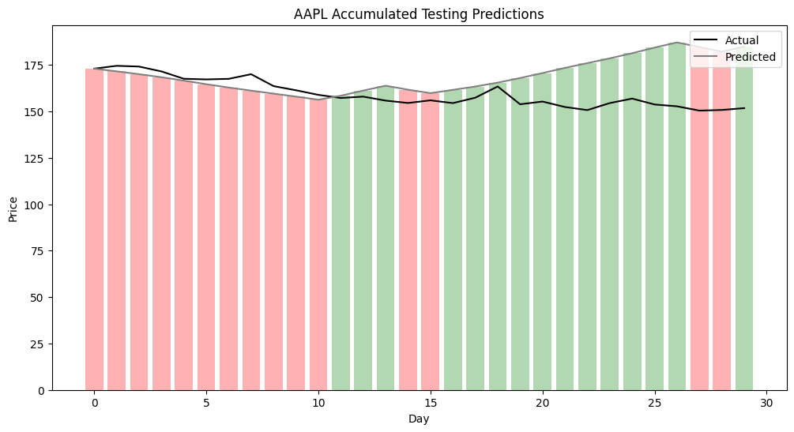

# stocks_with_feelings

## Overview
This project uses sentiment data (Tweets) and numerical stock info (e.g. opening/closing prices, trading volume, 52-week high/low) to predict stock price movement. We extract sentiment features using BERT-based models and classify tweets into three categories: positive, negative, and neutral. We use numerical stock data to derive technical stock market metrics such as relative strength index (RSI), moving average convergence dievergence (MACD), and various moving averages. The sentiment and numerical features used to train RNN-based architectures that predict direction and magnitude of future stock price movement.

NOTE: Many existing stock price prediction projects publicly available on Github predict the closing price instead of the stock price movement (change in price the next day). The latter is much harder to model, and it's what we actually care about as investors.

## Sentiment Preprocessing
We extract sentiment data via a dataset of finance tweets from Kaggle. These tweets datapoints contain a timestamp, tweet text, and stock ticker of the relevant company (that the tweet is talking about). The preprocessing pipeline uses regular expressions to find and remove special characters, username mentions, and URLs. We also remove Common stop words as defined in the Python NLTK library.

## Numerical Preprocessing

