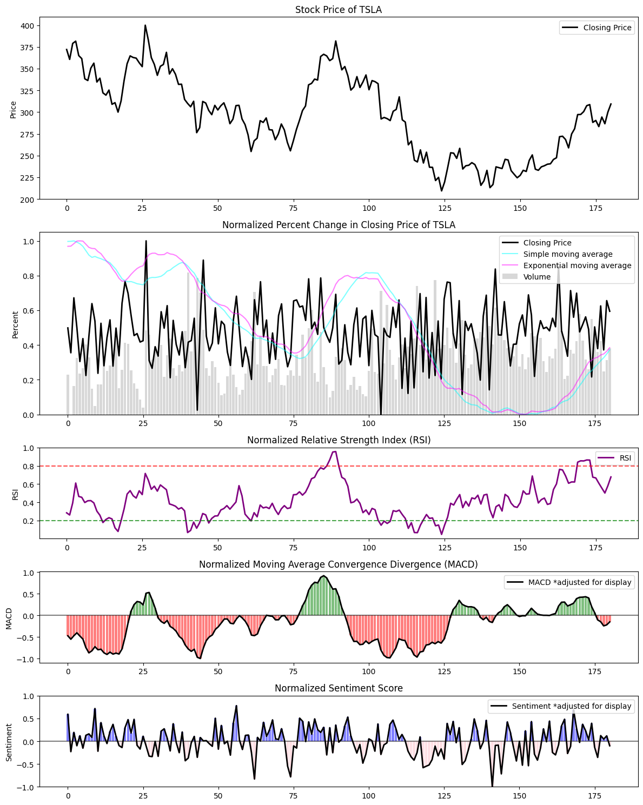
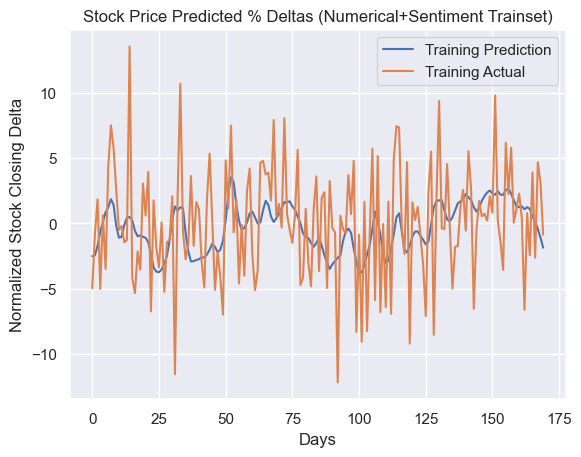
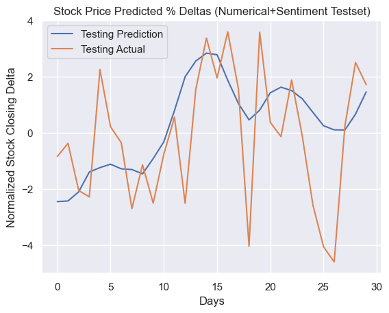

# stocks_with_feelings

## Overview
This project uses sentiment data (Tweets) and numerical stock info (e.g. opening/closing prices, trading volume, 52-week high/low) to predict stock price movement. We extract sentiment features using BERT-based models and classify tweets into three categories: positive, negative, and neutral. We use numerical stock data to derive technical stock market metrics such as relative strength index (RSI), moving average convergence dievergence (MACD), and various moving averages. The sentiment and numerical features used to train long short-term memory (LSTM), gated recurrent unit (GRU), and multi-head attention transformer machine learning models.

## Sentiment Preprocessing
We extract sentiment data via a dataset of finance tweets from Kaggle. These tweets datapoints contain a timestamp, tweet text, and stock ticker of the relevant company (that the tweet is talking about). The preprocessing pipeline uses regular expressions to find and remove special characters, username mentions, and URLs. We also remove Common stop words as defined in the Python NLTK library.

## Numerical Preprocessing
We compute the set of useful technical features listed below:
 - Simple Moving Average
 - Exponential Moving Average
 - Relative Strength Index
 - Moving Average Convergence Divergence
 - Normalized Trade Volume
 - Normalized Single Day Price Fluctuation

We also test different methods of closing price normalization:
 - Dataset all time high/low normalization: Effective but not realistic because requires knowing future stock prices to determine all time high/low
 - 30-day moving high/low normalization: Only effective when stock price is not setting a new 30-day high or low because on such days, the normalized price would not change
 - Accumulated percent deltas: Accumulate the percentage change in closing prices (e.g. +2.4%) to obtain a "normalized" stock price. We end up using this approach because it is able to represent the stock's closing price movement relatively well as long as the closing price does not fluctuate wildly between days (e.g. +2.4% when the stock is valued at $10 is much different from +2.4% when the stock is valued at $100)

## Best Results
NOTE: For the sentiment feature extraction, we end up using FinBERT which is a pretrained financial sentiment analysis based on the BERT transformer architecture. We went this route because the FinBERT model performed much better than our transformer model in classifying financial sentiment, which makes sense as FinBERT was trained on a much larger volume of data.

The following charts show output price movement predictions from our GRU model generated 2 days in advance (e.g. the price movement prediction for Wednesday is generated 2 days in advance on Monday)

The trained model has a day-to-day accuracy of 62.2%, and significant day accuracy of 76.5%. We define a "correct" day as a day where the model predicted the current direction of stock price movement (up or down) and a signifcant day as a day where the model predicts a movement with a magnitude greater than 2%.

## Future Work
These results show proof of concept for predicting stock price movement using numerical and sentiment data. One challenge encountered was overfitting, likely due to our relatively small dataset (~1 year of data). Our model also does not model long-term growth well as a result of the small dataset. We see this when testing our model on a dataset containing 10 years of Google stock price information. The model's performance can be improved by incorporating quarterly earnings reports to predict long-term trends and stock options tables to better predict the magnitude of price movements.
